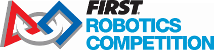

 

# AMHS Robotics 4681
Archibishop Murphy High School's FRC (FIRST Robotics Competition) team

## Upcoming meeting and events

Unless otherwise specified, all Mon-Fri meetings are 3-5pm in the portable.
All Sat meetings are 10am-2pm in the portable.

### Week 4 : Sat 26 Jan - Fri 1 Feb

General plan for week: Finish core robot build

* Sat 26 Jan
   * Meet from 10am - 3pm (lunch provided)
   * ~~Possibly extend this meeting until 4pm if we don't get enough done during Finals week.~~
* Mon 28 Jan:
   * Meet from 3pm until **6pm**.
* Tue 29 Jan - Fri 1 Feb
   * Meet from 3pm until 5pm (regular schedule).

### Week 5 : Sat 2 Feb - Fri 8 Feb

### Week 6 : Sat 9 Feb - Fri 15 Feb

### Week 7 : Sat 16 Feb - Fri 22 Feb

* Tue 19 Feb - **Stop Build Day** @ 8:00 pm

### Week 8 : Sat 23 Feb - Fri 1 Mar

* Week 1 Competitions

[Previous meetings...](docs/2019/meetings.md)

## 2019 Competition Information

* [Main Competition Info](docs/2019/)
* [Team Info](docs/2019/teams.md)
   * [Business Team](docs/2019/business-team.md)

## Documentation

* [Post-mortem documents](docs/post-mortem.md)

## Help

* [Mastering Markdown](https://guides.github.com/features/mastering-markdown/) - How to format Markdown (.md) files
